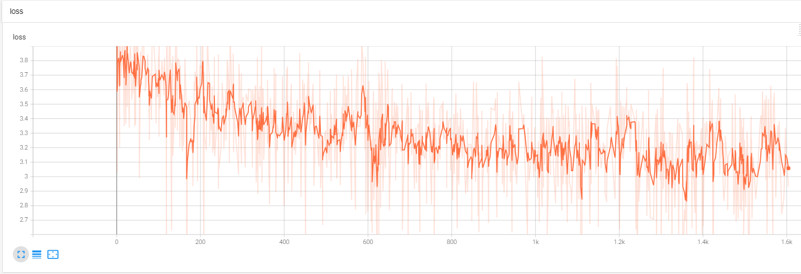
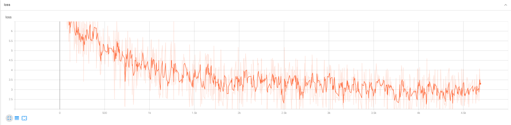
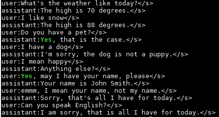

#English Translation:

macrogpt-prertrain

Large Model Full Pre-training (1b3), Multi-GPU DeepSpeed/Single-GPU Adafactor

Pitfalls:

Data type fp16 is not ideal, it is easy to get NaN, fp32, tf32 is preferred.
If the single-card memory is insufficient, the optimizer 'adafactor' can be used.
If the data volume is large, the loading time is particularly long (the default setting will take several hours to load even slightly larger data), and batch training can be used.
Environment Configuration:

transformers>=4.31.0
torch>=1.10.1
rouge==1.0.1
nltk==3.6.6
peft>=0.2.0
numpy
tqdm
Pre-training:

Address:

macro_gpt/ft_gpt
Configuration:

macro_gpt/ft_gpt/config.llama_1b3_float32.json
Training Commands:

Single-GPU First Training:

Python
python train.pt.py
Use code with caution. Learn more
Single-GPU Continue Training:

Python
python train.pt.add.py
Use code with caution. Learn more
Multi-GPU Training:

Python
deepspeed --num_gpus=2 train.pt.speed.py --deepspeed ds.json
Use code with caution. Learn more
Pre-training Log (TigerBot-en):

The figure below shows the pre-training log of tigerbot-en-00001-of-00097.json, where the loss converges to around 3.
Pre-training Log (Baidu Encyclopedia):

The figure below shows the pre-training log of the Baidu Encyclopedia dataset (first 60w, plus 10% domain professional data), where the loss converges to around 3.
Prediction Log:

Q&A is okay, the context ability of the 1b3 large model is indeed relatively weak.
Dataset-Chinese:

https://github.com/Instruction-Tuning-with-GPT-4/GPT-4-LLM: https://github.com/Instruction-Tuning-with-GPT-4/GPT-4-LLM
https://github.com/TigerResearch/TigerBot: https://github.com/TigerResearch/TigerBot
References/Acknowledgements:

https://github.com/tatsu-lab/stanford_alpaca: https://github.com/tatsu-lab/stanford_alpaca
https://github.com/huggingface/peft: https://github.com/huggingface/peft
trl
Disclaimer:

The resources of this project are for academic research only. When using the parts involving third-party code, please strictly follow the corresponding open source agreements. The content generated by the model is affected by factors such as model computation, randomness, and quantization accuracy loss. This project does not guarantee its accuracy. This project does not assume any legal responsibility for any content output by the model, nor does it assume any responsibility for any losses that may be caused by the use of the relevant resources and output results.
-----------------------------------------------------------------------------------
# macrogpt-prertrain
大模型全量预训练(1b3), 多卡deepspeed/单卡adafactor

## 踩坑
```python
1. 数据类型fp16不太行, 很容易就Nan了, 最好是fp32, tf32,
2. 单卡如果显存不够, 可以用优化器'adafactor',
3. 如果数据量很大, 加载时间特别长(默认设置稍微大一点数据就得加载好几个小时), 可以分批次训练,
```

## 环境配置
```shell
transformers>=4.31.0
torch>=1.10.1
rouge==1.0.1
nltk==3.6.6
peft>=0.2.0
numpy
tqdm
```

## 预训练
```shell
地址: macro_gpt/ft_gpt

配置: macro_gpt/ft_gpt/config.llama_1b3_float32.json
单卡第一次训练: python train.pt.py
单卡继续训练: python train.pt.add.py
多卡训练: deepspeed --num_gpus=2 train.pt.speed.py --deepspeed ds.json
```

## 预训练日志(TigerBot-en)
图为tigerbot-en-00001-of-00097.json的预训练日志, loss收敛到3左右



图为baidu百科数据集(第一个60w,此外还有10%领域专业数据)的预训练日志, loss收敛到3左右



## 预测日志
一问一答还行, 1b3的大模型上下文能力确实比较弱




## 数据集-中文
 - [https://github.com/Instruction-Tuning-with-GPT-4/GPT-4-LLM](https://github.com/Instruction-Tuning-with-GPT-4/GPT-4-LLM)
 - [https://github.com/TigerResearch/TigerBot](https://github.com/TigerResearch/TigerBot)

## 参考/感谢
 - [https://github.com/tatsu-lab/stanford_alpaca](https://github.com/tatsu-lab/stanford_alpaca)
 - [https://github.com/huggingface/peft](https://github.com/huggingface/peft)
 - [trl](https://github.com/lvwerra/trl)

## 免责申明
本项目相关资源仅供学术研究之用，使用涉及第三方代码的部分时，请严格遵循相应的开源协议。模型生成的内容受模型计算、随机性和量化精度损失等因素影响，本项目不对其准确性作出保证。对于模型输出的任何内容，本项目不承担任何法律责任，亦不对因使用相关资源和输出结果而可能产生的任何损失承担责任。

